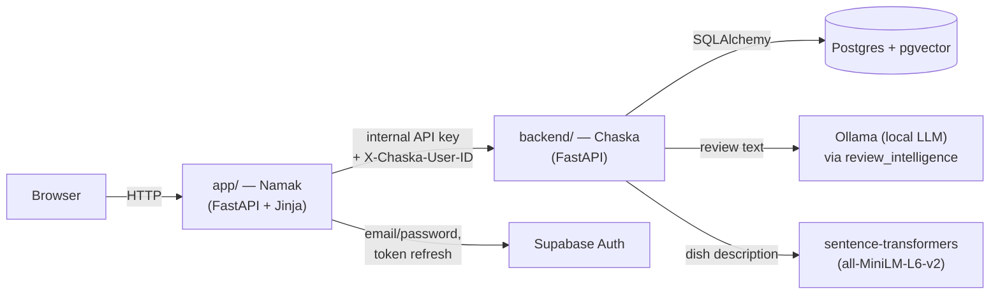
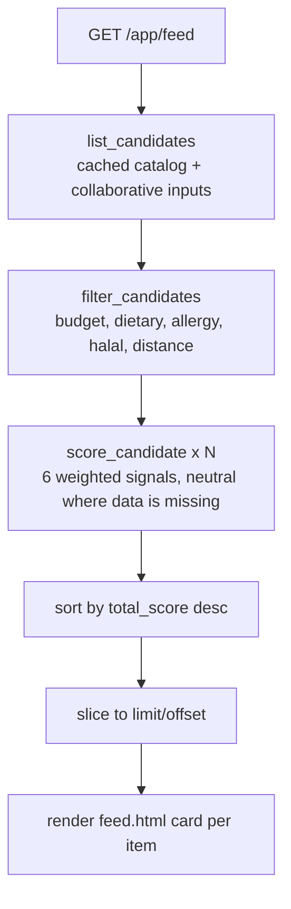

# Namak / Chaska — End-to-end flow and architecture

This is the master reference for how a request actually moves through the system:
how a taste profile is captured and turned into numbers, where those numbers live,
how a restaurant's menu gets into the database, how a review becomes a sentiment
score, and how all of that becomes one ranked feed. Every claim below is traced to
the file and function that does it — not a design intention, but what the code on
`develop` actually does today.

> Two other docs already cover pieces of this in more formal detail:
> [`docs/ranking.md`](ranking.md) and [`docs/collaborative-ranking.md`](collaborative-ranking.md).
> `ranking.md` describes an earlier shape of the system (a standalone "Ranking API"
> service, a 7-signal weight table with `context` and `collaborative` as top-level
> signals). That shape changed — ranking now lives inside the one Chaska backend,
> and collaborative evidence folds into `food_profile` rather than standing alone.
> `collaborative-ranking.md` is accurate and matches the code exactly; this document
> supersedes `ranking.md`'s architecture description.

---

## 1. The two services, in one sentence each

| Service | Role | Owns |
|---|---|---|
| **`app/`** — "Namak" | FastAPI + Jinja2 web app. Renders every page the customer sees. | Nothing persistent. It's a thin client. |
| **`backend/`** — "Chaska" | FastAPI JSON API. All business logic, all scoring, all writes. | Postgres (via SQLAlchemy + pgvector). |

Namak never touches the database directly. Every read or write goes through
`app/backend_client.py` (`ChaskaBackendClient`), which makes an HTTP call to Chaska.
This means Namak can be redeployed, redesigned, or replaced without touching a
single scoring rule, and Chaska can be tested and scored without ever rendering
HTML.



A third, quieter piece: **`review_intelligence/`** is a self-contained module that
turns review text into structured scores. Chaska calls into it in-process
(`backend/app/services/data_core/review_processing.py`); it is not its own running
service, but it is architecturally separate — it doesn't know about restaurants,
users, or ranking, only about text in and scores out.

---

## 2. Identity: who "the user" is, in two systems at once

**Why two systems for one user?** Because authentication (proving you are who you
say you are) and taste modeling (what you like to eat) are different concerns with
different trust boundaries. Namak doesn't want to be in the business of storing
passwords — Supabase Auth already does that safely. But Supabase has no concept of
"taste vector" or "budget range" — that's Chaska's job.

**How they're kept in sync:** the same UUID is used as the primary key in both
places.

1. User submits the signup/login form → `app/auth.py`'s `SupabaseAuthProvider`
   calls Supabase Auth (`sign_up` / `sign_in_with_password`). Supabase returns a
   session with `access_token`, `refresh_token`, and a `user.id` (a UUID it
   generated).
2. Namak immediately calls `backend.sync_user(result.user.id, result.user.name,
   result.user.email, role)` — see `app/routers/web.py:424` (signup) and `:521`
   (login).
3. Chaska's `POST /users/sync` (`backend/app/api/routes/users.py`) does a
   get-or-create on the `users` table **using that same UUID as the primary key**.
4. Namak stores the Supabase tokens in a signed session cookie
   (`app/session.py`'s `SignedSessionMiddleware`) — never in a database.

From this point on, every authenticated request to Chaska carries
`X-Chaska-User-ID: <uuid>` as a header. Chaska's `_authorize()` helper in
`users.py` checks that header matches the resource being requested — a user can
only ever read or write their own row.

**Why this matters for everything below:** "the user's taste vector" always means
`users.taste_vector` in Postgres, addressed by that shared UUID — never something
cached in the browser or the Supabase session.

---

## 3. Capturing the initial taste profile (onboarding)

### What is actually asked

A 5-step wizard, `GET/POST /onboarding/{step}` in `app/routers/web.py`. Each step
writes into a **session-stored draft** (`request.session["onboarding"]`) — nothing
touches Chaska until the wizard is complete. This is why "Back" works without
losing earlier answers, and why abandoning onboarding halfway leaves no partial
profile in the database.

| Step | Collects | Validation |
|---|---|---|
| 1 | `city`, `preferred_cuisines[]` | both required |
| 2 | `favourite_dishes[]` (free-text tags) | **at least 3** required |
| 3 | 6 taste levels, 0–5 each: spice, sweetness, sourness, saltiness, oiliness, richness | each in range 0–5 |
| 4 | `preferred_textures[]`, `dietary_requirements[]`, `allergies[]`, `disliked_ingredients[]`, `require_halal` | — |
| 5 | `budget_min`, `budget_max` | `budget_min ≥ 0`, `budget_max ≥ budget_min` |

Step 5 is where everything gets assembled and sent. The draft dict is validated
against `OnboardingAnswers` (`app/models.py`), then two things happen in the same
request:

### Why turn answers into a vector at all

The ranking engine (section 6) scores *every dish* against the user in one pass
using cosine similarity — a single number comparison. That only works if "what the
user wants" and "what the dish is" live in the **same 384-dimensional space**. A
free-text answer like `favourite_dishes: ["Biryani", "Karahi"]` isn't comparable to
a dish's spice level directly — it has to become a vector first.

### How the vector is built

`app/personalization.py`'s `build_taste_vector(answers)`:

1. Five separate bags of text are embedded independently via `app/embedding.py`'s
   `embed_terms()` — a deterministic hash-seeded embedding (not a real language
   model on the Namak side; see the caveat in §9):
   - preferred cuisines
   - favourite dishes
   - the six taste levels, turned into phrases like `"strong spice"`,
     `"moderate sweetness"` (via `_level_phrase()`)
   - preferred textures
   - dietary requirements
2. The five resulting unit vectors are combined by a **weighted average**, not an
   equal blend:

   | Signal | Weight | Why this weight |
   |---|---|---|
   | Preferred cuisines | 35% | Strongest, most explicit signal of taste |
   | Favourite dishes | 30% | Equally explicit, slightly more specific/noisy |
   | Taste levels (spice etc.) | 20% | Real signal, but also enforced as hard filters downstream, so it doesn't need to dominate the *soft* vector too |
   | Preferred textures | 10% | A lighter hint |
   | Dietary requirements | 5% | Mostly enforced as a hard filter elsewhere, so its vector contribution is intentionally small |

   (comment in the source, `app/personalization.py:18-23`, explains this directly:
   dietary/allergy fields are hard filters on the backend, so they shouldn't also
   dominate the soft similarity score.)
3. The weighted sum is re-normalized to a unit vector. This final 384-float array
   *is* the user's taste vector.

### Where it's stored

`payload["taste_vector"] = build_taste_vector(answers)` is attached to the rest of
the onboarding answers and sent in one call: `backend.update_profile(user.id,
payload)` → `PUT /users/{id}/profile` → `backend/app/api/routes/users.py`:

```python
for field, value in payload.model_dump(exclude={"taste_vector"}).items():
    setattr(user, field, value)
user.taste_vector = payload.taste_vector
user.taste_updated_at = datetime.now(UTC)
user.onboarding_complete = True
```

Every onboarding answer becomes a column on the `users` row — `preferred_cuisines`,
`favourite_dishes`, `spice_preference`...`richness_preference`, `budget_min/max`,
`dietary_requirements`, `allergies`, `disliked_ingredients`, `require_halal` — **and**
`taste_vector`, stored as a native `pgvector` column (`Vector(384)`,
`backend/app/models/user.py`). Postgres, not the browser, not a cache, is the one
source of truth for "who this user is, tastewise."

Once step 5 succeeds, the session draft is discarded
(`request.session.pop("onboarding", None)`) and the completion page renders —
there is nothing left in Namak's memory of the wizard; everything that matters is
now a database row.

---

## 4. The restaurant & menu catalog: where dishes come from

Two distinct data sources feed the `restaurants` / `dishes` tables, and they are
treated very differently.

### 4a. The seeded catalog (`data/real_catalog/`)

This is **not fabricated data**. Per `data/real_catalog/README.md`: 30 real
restaurant branches and 90 real menu items, each with names, prices, and addresses
sourced from public listings, tracked per-item in `sources.json`. The manifest
distinguishes:

- **Facts** (restaurant name, dish name, regular price, address): pulled from a
  cited public source URL. Never invented.
- **Editorial estimates** (the 0–5 taste dimensions — spice/oiliness/etc — and
  texture tags): assigned by a human for cold-start bootstrapping, explicitly
  *not* claimed as restaurant-published facts. The README is blunt about this:
  "Applications must not display them as claims made by the restaurant."
- **Deliberately absent**: coordinates (no branch-specific pair was confidently
  verified — so `location_verified=False` and the ranking engine treats distance
  as neutral for these rows, see §6), halal status (`unknown` throughout — no
  claim is inferred from cuisine or geography).

`backend/scripts/seed.py` loads this manifest into Postgres. Critically, it also
**computes a real embedding for every dish** at seed time:

```python
build_dish_embedding_text(name=..., description=..., cuisine=..., ingredients=...,
    spice_level=..., oiliness=..., ... )
# -> "name: Chicken Karahi | description: ... | cuisine: Pakistani | ingredients: ... |
#     taste: spice 4/5, oiliness 3/5, ... | textures: ... | dietary: ... | ..."
```

That composed sentence is embedded with `SentenceTransformerEmbeddingProvider`
(**a real model — `sentence-transformers/all-MiniLM-L6-v2`**, run locally, no
external API call) and stored as `dishes.embedding` (`Vector(384)`,
`backend/app/services/data_core/embeddings.py`). This is a genuinely different,
higher-fidelity embedding pipeline than the one used for the *user's* taste vector
(§3) — dishes get a real language-model embedding; the user's onboarding answers
currently get a deterministic hash-based one. They're comparable (same 384
dimensions, same normalization) but not produced the same way. That asymmetry is a
real gap worth knowing about — see §9.

### 4b. Partner-added dishes

A restaurant partner (role `restaurant_partner`) adds dishes through their own
dashboard (`backend/app/api/routes/partner_dishes.py`). These don't go through the
sentence-transformers pipeline at all — `backend/app/services/data_core/
dish_profiles.py`'s `DeterministicDishEmbeddingService` builds a vector by
SHA-256-hashing the dish's name/cuisine/ingredients/tags into 384 pseudo-random,
unit-normalized floats. It's explicitly a placeholder ("Stable local baseline;
replaceable without changing partner contracts") — deterministic so tests are
stable, but it carries **no actual semantic meaning**. A partner dish's embedding
similarity to a user's taste vector is closer to noise than to a real taste match.
This is the single biggest asymmetry in the whole system: seeded dishes are ranked
on real semantic similarity, partner-added dishes currently aren't.

### How Namak reads the menu

`GET /app/restaurants/{id}` → `backend.restaurant_dishes(id)` →
`GET /restaurants/{id}/dishes` on Chaska → `DishRepository` (Postgres query,
`archived_at IS NULL`, joined to the restaurant for lat/lng). Nothing is cached or
duplicated in Namak; every page load is a fresh read.

---

## 5. Reviews and sentiment: what happens when someone writes one

### Why a review can't be submitted freely

`POST /reviews` (`backend/app/api/routes/reviews.py`) enforces a specific order of
events before it accepts text:

1. The user must have a prior `Interaction` with `action == "tried"` on that dish
   already recorded. There's no way around this via the API — the check is a
   database query, not a UI-only gate.
2. `tried_confirmation` must be `true` on the payload — an explicit second
   confirmation, not implied by having clicked "tried" once.
3. Only one active review per (user, dish) — a second submission on the same dish
   is rejected with 409 unless it's an idempotent retry of the same
   `submission_key`.

**Why:** this is a deliberate anti-fake-review design. You cannot review a dish you
haven't first told the system you tried, and you can't flood a dish with repeat
reviews.

### How sentiment is actually extracted

This is the one synchronous LLM call in the whole system. When a review is
created or edited, `_process()` in `reviews.py` calls
`backend/app/services/data_core/review_processing.py`'s `LiveReviewProcessor`,
which in turn calls into `review_intelligence/src/extractor.py`'s
`ReviewExtractor`:

1. The raw review text (plus the numeric star rating, as context) is sent to a
   **local Ollama server** (`review_intelligence/src/config.py` —
   `OLLAMA_HOST`/`OLLAMA_MODEL`, defaulting to `llama3.2`) with a long, carefully
   worded prompt (`extractor.py:PROMPT`) asking for exactly one JSON object:
   `{"sentiment": 0-1, "spice_level": 0-1, "oiliness": 0-1, "flavor_tags": [...]}`.
2. The model's raw output is **not trusted as-is**. A layer of deterministic
   rules re-derives or overrides parts of it:
   - `_spice_from_text()` / `_oiliness_from_text()` re-derive those two scores
     directly from regex pattern matches on the text (`"very spicy"` → 0.9,
     `"slightly oily"` → 0.5, a negated mention like `"not spicy"` → 0.0
     unconditionally) — the model's own number for these two fields is discarded
     in favor of this rule pass.
   - `_rule_assisted_sentiment()` blends the model's sentiment with keyword
     counting (a fixed list of positive/negative words) and the star rating: if
     the text is unambiguously negative, a hallucinated positive score from the
     model is overridden outright; if a rating was supplied, the final sentiment
     is `0.6 × rating-derived-score + 0.4 × text-derived-score`.
   - `_normalise_tags()` throws out any tag the model invented that isn't backed
     by an actual word match in the review text, and explicitly strips a tag if
     the text negates it (`"not greasy"` can never produce the `greasy` tag).

   **Why this rule layer exists at all:** an LLM alone is prone to two failure
   modes here — outputting 0.5 for everything it's unsure about, and inventing
   plausible-sounding tags the review never actually said. The rule layer is a
   deterministic safety net specifically so that "the model was too lazy to
   commit" or "the model hallucinated a tag" can't reach a diner as a false
   signal.
3. Separately, `review_intelligence/src/embeddings.py`'s `ReviewEmbedder` produces
   a sentence-transformers embedding of the review text (currently computed and
   stored on `reviews.review_embedding`, but not yet consumed anywhere downstream
   — the aggregate `review_vector` in the standalone `review_intelligence` API
   contract exists for a future use).

### What happens if Ollama isn't running

This is handled explicitly, not left to crash the request. `_process()` wraps the
whole call in `try/except Exception` — if Ollama is unreachable (or returns
malformed JSON, or times out), the review is still saved, but
`processing_status` is set to `"unavailable"` and `sentiment`/`spice_score`/
`oiliness_score` stay `None`. `_recompute()` (below) only ever averages reviews
where `processing_status == "complete"` — an unprocessed review contributes its
star rating to `review_count`/`review_average` but nothing to sentiment.

### From individual review → dish-level number

Every create or edit calls `_recompute(dish, all_active_reviews_for_that_dish)`,
which rewrites five columns on the `dishes` row directly (not a background job,
not eventually-consistent — it happens inside the same transaction as the review
write):

- `review_count`, `review_average` — over *all* reviews, regardless of processing
  status
- `review_sentiment`, `review_spice`, `review_oiliness` — the mean, but only over
  `processing_status == "complete"` reviews
- `review_flavor_tags` — the top 8 most frequent tags across all processed
  reviews, ties broken alphabetically

This is why the ranking engine (next section) can read `dish.review_sentiment`
directly with no join, no API call, no recomputation at scoring time — it's
already a plain column, kept current by every write.

---

## 6. The ranking engine: turning a request into a sorted, scored feed

`GET /app/feed` → `backend.get_feed(user_id, params)` →
`GET /ranking/feed/{user_id}` → `RankingFeedService.get_ranked_feed()`
(`backend/app/services/ranking/feed_service.py`). Three stages, always in this
order:

### Stage 1 — load candidates

`RankingRepository.list_candidates()` (`backend/app/repositories/ranking.py`)
pulls every available, non-archived dish (joined to its restaurant and any active
deals) in one query, plus the current user's own `saved` dish IDs, plus — folded
in by `_with_collaborative_evidence()` — a collaborative score per dish where
applicable (§7).

*Performance note, since this was a real problem earlier in this project's
history:* this candidate set (dish rows + every user's taste vector, needed for
collaborative scoring) is identical for every requester in a given moment, so it's
cached in-process for 300s (catalog) / 60s (collaborative inputs) rather than
re-fetched on every single request — see the comment block at the top of
`ranking.py` for the measured before/after. Per-user data (the `saved` set, the
final score) is never cached.

### Stage 2 — hard filters

`filter_candidates()` (`backend/app/services/ranking/generator.py`) removes
anything that plainly doesn't qualify — this happens *before* any scoring, so a
dish that fails here never appears at any rank:

- Not available, or archived
- Outside the requested `[budget_min, budget_max]` price band
- Missing a required dietary tag (e.g. `vegetarian`)
- Contains an allergen the user listed
- Contains an ingredient the user listed as disliked
- `require_halal=true` and the restaurant's `halal_status` isn't `verified` or
  `claimed`
- Outside `max_distance_km`, but **only** if the restaurant has *verified*
  coordinates and the user supplied their own location — an unverified restaurant
  is never excluded on distance, it's simply not penalized or rewarded by it (see
  the neutral-signal rule below).

### Stage 3 — score every surviving candidate

`score_candidate()` (`backend/app/services/ranking/scoring.py`) computes six
named signals, each 0–100, and combines them with fixed weights:

| Signal | Weight | What it actually measures | How |
|---|---|---|---|
| **taste** | 45% | Cosine similarity between the user's `taste_vector` and the dish's `embedding` | `max(0, cosine) × 100` |
| **food_profile** | 20% | Rule-based match on cuisine/favourite-dish name, the 6 taste-level deltas, and texture overlap — blended with collaborative evidence when present | see below |
| **review** | 10% | Real sentiment if available, else star rating as a fallback | `sentiment × 100`, or `rating/5 × 100` |
| **distance** | 10% | How close the restaurant is, relative to the requested max distance | `100 × (1 - distance_km / horizon)` |
| **price** | 10% | Where the dish sits inside the requested budget band | linear, cheaper-within-budget scores higher |
| **popularity** | 5% | Interaction count relative to the busiest dish *in this candidate set* | `count / max_count × 100` |

`food_profile` in detail (`_food_profile_score()`): 40% weight on a binary
cuisine-or-favourite-name match, 40% on the average closeness of the dish's six
taste dimensions to the user's six preference levels (`100 × (1 - |actual -
preferred| / 5)`, averaged), 20% on texture-tag overlap. If a collaborative score
exists for this dish (§7), the *final* `food_profile` becomes `70% ×
content-score + 30% × collaborative-score` — collaborative evidence never becomes
its own top-level signal; it only ever adjusts this one.

**The neutral-signal rule, and why it's the most important design decision in this
whole engine:** if a signal has *no data to work with* for a given
user/dish pair — no taste vector, no review yet, no verified coordinates, no
budget supplied — that signal is set to a flat **50** (`NEUTRAL_SCORE`) rather than
0 or being dropped from the weighted sum. The reasoning is explicit in the code
and worth stating plainly: a dish should never be punished or boosted by the
*absence* of a signal, only by what's actually known. A new dish with zero reviews
scores exactly the middle on `review`, not zero — it isn't penalized for being
new. Every neutral signal used is tracked (`neutral_signals: frozenset[str]`) and
surfaced to the UI so a card can honestly say "strongest available match: X"
instead of implying every signal was meaningfully evaluated.

The six weighted signals sum to one `total_score`, rounded and shown to the user
as **match_percentage**. Results are sorted by that score, then by dish name, then
by UUID for a fully deterministic tie-break — running the same request twice
against unchanged data always produces the same order.



---

## 7. Collaborative filtering — "Taste Twins"

This runs as part of Stage 1 (`_with_collaborative_evidence()` in
`ranking.py`), before scoring, and it answers a narrower question than the main
engine: *has someone with a similar palate to this user already vouched for this
specific dish?*

**How a "twin" qualifies** — both gates must pass:

1. **Cosine similarity** between the two users' taste vectors ≥
   `settings.collaborative_min_similarity` (config, not hardcoded — see §9 for why
   this value matters in practice).
2. **Shared evidence**: the two users must have both engaged with at least one
   overlapping dish, at a combined quality ≥ `collaborative_min_evidence`. Evidence
   quality per (user, dish) pair is the strongest of: `like` (1.0), `save` (0.85),
   `order` (0.75), `tried` (0.5), or a positive review's rating-derived quality —
   each decayed by recency (`_recency()`: linearly down-weighted over a year, floor
   0.5). **Clicks never count as evidence.** A negative review or an explicit
   `dislike` on a shared dish actively removes that dish from being usable
   evidence between the two users.

For each dish, up to 5 qualifying neighbours contribute; the collaborative score is
their mean contribution (`similarity × evidence_quality`, capped and scaled to
0–100). The two highest-similarity neighbours who left an actual positive review
on that dish are surfaced to the UI as `taste_twin_reviews` — this is the "2 taste
twins tried this" block you see on a feed card, with each reviewer's name (or
`"Anonymous Chaska diner"` if they opted out of `show_review_display_name`), their
star rating, and a 180-character excerpt.

---

## 8. Learning from behavior: the taste vector isn't static

Onboarding sets the *initial* vector, but it keeps moving. Every interaction
(`POST /users/{id}/interactions`, `backend/app/api/routes/users.py`) is recorded
as a row in `interactions` — but for four specific actions, it *also* nudges the
user's stored vector:

```python
if payload.action not in {"tried", "dislike"} and user.taste_vector is not None and dish.embedding is not None:
    alpha = 0.15
    blended = [(1 - alpha) * old + alpha * new for old, new in zip(user.taste_vector, dish.embedding)]
    user.taste_vector = normalize(blended)
```

This is an exponential moving average: every `save`, `order`, `like`, or `click`
pulls the vector 15% of the way toward the dish's own embedding, then
re-normalizes. `tried` and `dislike` are deliberately excluded — trying something
isn't necessarily liking it, and a dislike shouldn't pull the profile *toward* the
disliked dish. **Why this matters:** it means the taste profile a user "answers
once" at onboarding is a starting point, not a ceiling — real usage continuously
reshapes it, and the ranking engine on the very next request reflects that.

---

## 9. Known asymmetries and operational dependencies

Worth knowing before trusting a specific score too literally:

- **User vectors vs. seeded-dish vectors use different embedding methods.** The
  user's onboarding vector (`app/embedding.py`) is a deterministic hash-seeded
  pseudo-embedding — same input text always produces the same output, but it
  carries no real linguistic meaning. Seeded dishes (`backend/.../embeddings.py`)
  use a real sentence-transformers model. They're numerically comparable
  (same dimension, same normalization) but not semantically equivalent — a
  "taste" cosine-similarity score is more meaningful for seeded dishes than the
  raw number might suggest.
- **Partner-added dishes get an even weaker embedding** — a SHA-256 hash of their
  attributes, explicitly a placeholder (`dish_profiles.py`). Their `taste` signal
  is closer to noise than signal until this is swapped for a real model.
- **Review sentiment requires a local Ollama server to be running.** If it isn't,
  reviews still save, but `processing_status="unavailable"` and that review is
  silently excluded from the dish's sentiment aggregate — not an error the user
  sees, but worth knowing when a dish's `review_sentiment` looks unexpectedly
  absent.
- **Collaborative thresholds are configuration, not fixed.** `.env`'s
  `COLLABORATIVE_MIN_SIMILARITY` (this environment currently runs at `0.35` —
  see the commit history around Taste Twins for why) directly controls how many
  users ever see a twin at all; it was found this session that at the code
  default (0.65) most seeded users had zero qualifying neighbours simply because
  the seed data is sparse.
- **Distance and price are neutral, not zero, when data is missing.** A
  restaurant without verified coordinates isn't ranked *worse* on distance — it's
  excluded from that signal entirely (§6). Don't read a high match percentage as
  proof every signal was actually evaluated; check `neutral_signals` in the
  response, or the card's "strongest available match" text in the UI.

---

## 10. One request, start to finish

To make all of the above concrete, here is literally what happens when a new
person uses the app for the first time:

1. **Signup** (`POST /signup`) → Supabase creates an auth user → Namak calls
   `sync_user()` → a bare `users` row exists in Postgres, `onboarding_complete=False`.
2. **Onboarding steps 1–5**, each a page load + form post, accumulating in the
   session only (§3). Step 5 builds the 384-float taste vector and `PUT`s the
   entire profile in one call — `onboarding_complete` flips to `True`.
3. **Redirect to `/app/feed`.** Namak calls `get_feed()` → Chaska loads every
   available dish (cached catalog, §6 Stage 1), removes anything outside budget/
   dietary/allergy/halal (Stage 2), and scores every survivor on the six signals
   (Stage 3) — `taste` is now meaningful for the first time, because a vector
   exists. Sorted, sliced, rendered as cards with a match percentage and an
   honest "strongest available match" explanation.
4. **User clicks "tried"** on a dish, later writes a review. The review can't be
   submitted until that `tried` interaction exists (§5). On submit, Ollama scores
   the text (with the deterministic rule layer correcting it), the dish's five
   review-aggregate columns are recomputed in the same transaction.
5. **User saves a different dish.** That `save` interaction nudges their taste
   vector 15% toward that dish's embedding (§8) — their *next* feed load will
   already reflect it.
6. **A different user with a similar (now-shifted) taste vector** loads their own
   feed. If they've engaged with an overlapping dish and clear the similarity
   threshold, the first user's positive review can now surface as a "Taste Twins"
   card on the second user's feed (§7) — collaborative evidence flowing between
   two accounts that have never interacted directly.

Nothing in that chain touches image resolution — dish photography
(`app/image_assets.py`) is resolved entirely on the Namak side, from a local
manifest of licensed photos, keyed off the dish's name/cuisine. It has no
connection to embeddings, scoring, or storage; it's purely presentational and
described here only so it's clear it's *not* part of the data model above.

---

## 11. File map — where to actually look

| Concern | File |
|---|---|
| Auth (Supabase) | `app/auth.py` |
| Session cookie | `app/session.py` |
| Namak ↔ Chaska HTTP client | `app/backend_client.py` |
| Onboarding wizard (UI) | `app/routers/web.py` (`onboarding_step`, `onboarding_submit`) |
| User's taste vector construction | `app/personalization.py`, `app/embedding.py` |
| User model (Postgres) | `backend/app/models/user.py` |
| Dish / Restaurant / Review / Interaction models | `backend/app/models/*.py` |
| Real catalog source data | `data/real_catalog/` (+ `README.md` there) |
| Catalog seeding + dish embedding | `backend/scripts/seed.py`, `backend/app/services/data_core/embeddings.py` |
| Partner dish embedding (placeholder) | `backend/app/services/data_core/dish_profiles.py` |
| Review sentiment extraction (LLM + rules) | `review_intelligence/src/extractor.py` |
| Review embedding | `review_intelligence/src/embeddings.py` |
| Review → dish aggregate wiring | `backend/app/api/routes/reviews.py` |
| Ranking: candidate loading + cache + collaborative evidence | `backend/app/repositories/ranking.py` |
| Ranking: hard filters | `backend/app/services/ranking/generator.py` |
| Ranking: scoring weights + neutral-signal logic | `backend/app/services/ranking/scoring.py` |
| Ranking: orchestration + response shaping | `backend/app/services/ranking/feed_service.py` |
| Interaction-driven EMA vector updates | `backend/app/api/routes/users.py` (`add_interaction`) |
| Dish photo resolution (UI-only, cosmetic) | `app/image_assets.py` |
